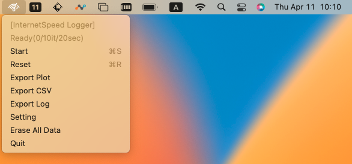
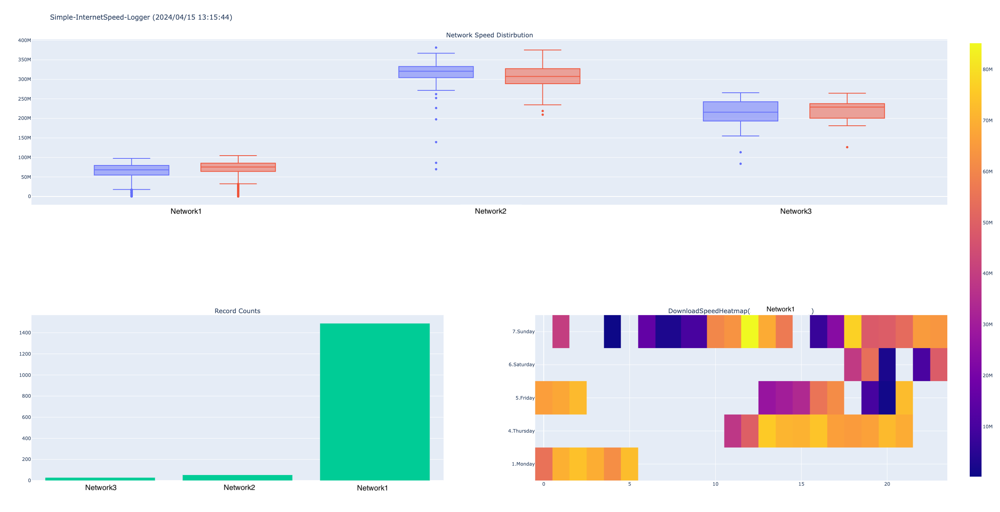
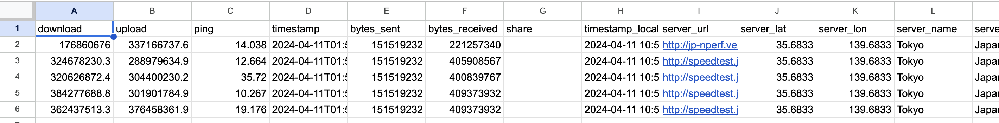
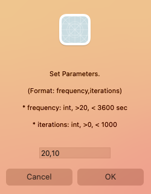

# Simple-InternetSpeed-Logger

Simple-InternetSpeed-Logger is a simple menu bar app for macOS to test internet bandwidth using speedtest.net.
Internet speed tests are often conducted, but most of them involve one-time measurements where speed is often discussed. However, internet speed can vary depending on factors such as time of day and PC environment. I believe it's more meaningful to understand this variability and discuss one's own internet environment. That's why this app runs in the menu bar and continuously measures internet speed in the background. It uses speedtest.net for internet speed measurement.
You can check statistically which networks are faster or slower compared to others. You can also see when your main network performs well on which day of the week and at what time.

and you can export stats report plot or csv data.

## Installation

Download latest version [release page](https://github.com/rauta0127/Simple-InternetSpeed-Logger/releases) and open it.

You might have to right click/control-click and select open if you get a warning that the app is from an unidentified developer. Move it to Applications if you want.

## Environments
I have confirmed that it works fine in the following environments.

- Apple M2
    - macOS13.4.1 (22F82)

## Usage

### Basic
You can start, pause, reset with button.

### Export Data
You can export plot html and raw csv and log files.
In the plots, you can see a box plot of download/upload speeds by network, a heatmap of speeds by day of the week and time for the main network, and the number of records. The network with the most records is defined as the main network. This allows you to see the speed differences between networks, as well as when the main network performs best on which day and time.
In the CSV file, you can review raw data, including download/upload speeds, server information, client information, and more.

### Set Parametes
You can change parameters of frequency and iterations.
- frequency: Frequency is the interval for measurements. It performs measurements at intervals specified seconds.
- iterations: Iterations is the number of measurements. It performs measurements the specified number of times.

### Erase Data
You can elase csv and log data in app. Be careful.

## Give me Bug Report and Contributions
This app is created simply and quickly. I think the testing is insufficient. Pull requests and suggestions are welcome! Please open an issue if you have a report or suggestion for imrovement. I will adapt to mood changes during my free time.

## References
Simple-InternetSpeed-Logger is made with rumps and the app or repos is built with py2app.
and I referenced the following apps. Thank you.

- [speedtest-cli](https://github.com/sivel/speedtest-cli): Simple-InternetSpeed-Logger use speedtest-cli source.
- [Timeglass](https://github.com/mountwebs/timeglass?tab=readme-ov-file): Menu bar app is made with rumps. 

## License
MIT